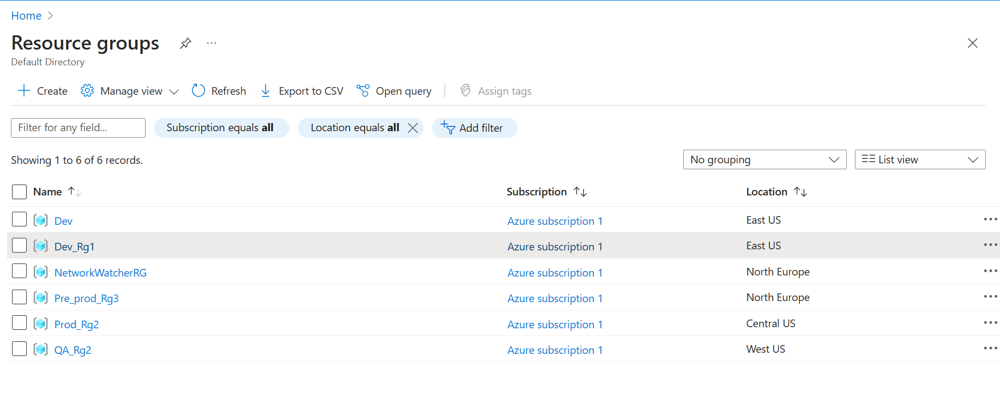
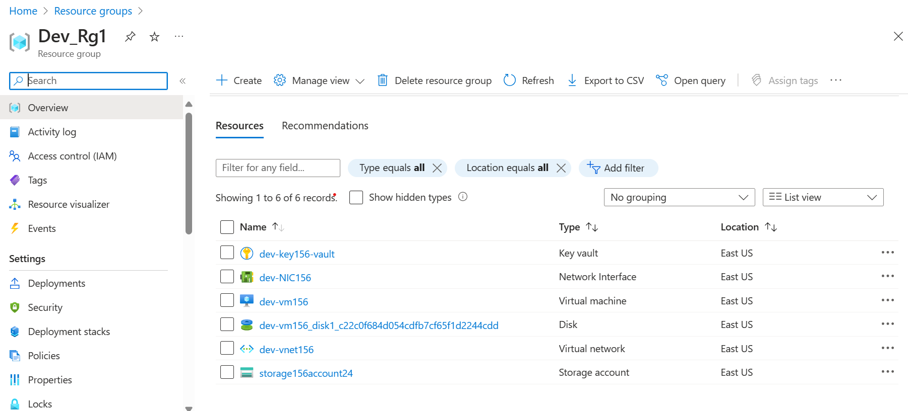
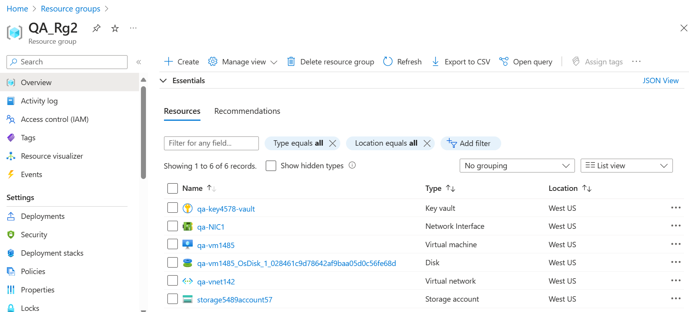
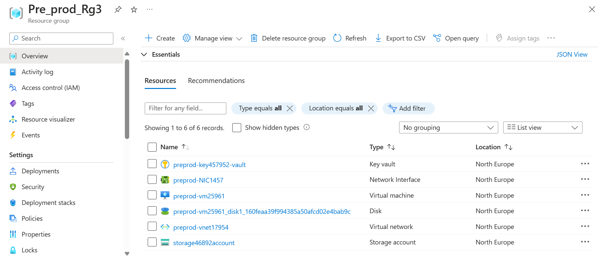
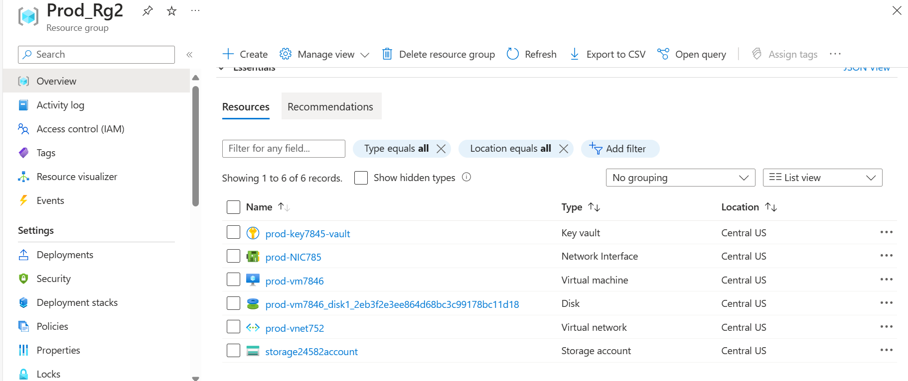
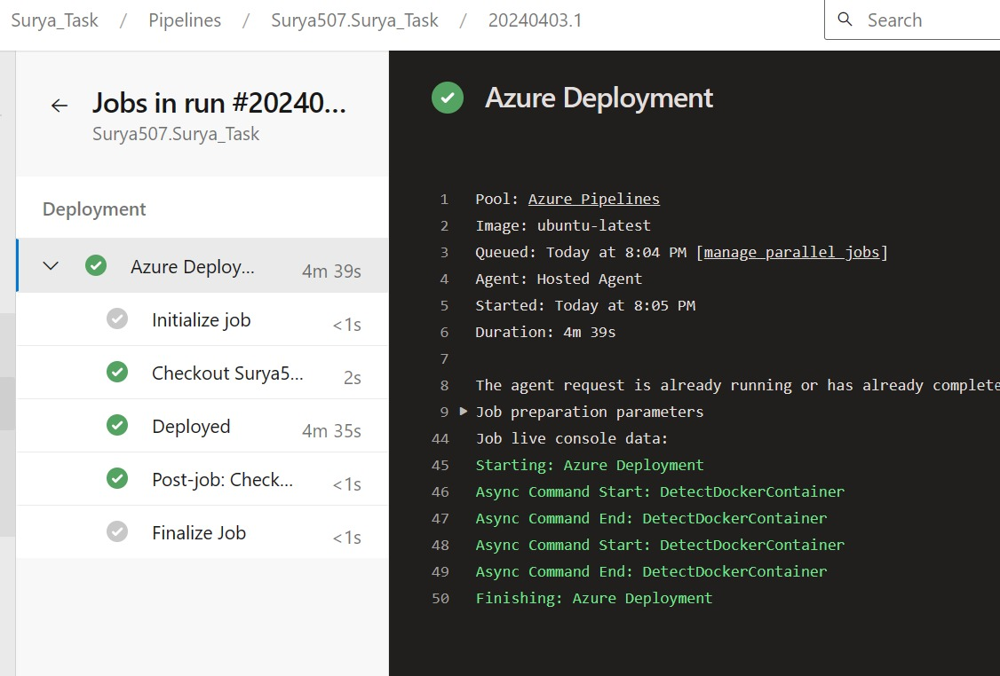

**<h1>CI/CD Pipelines for Infrastructure Provisioning with Terraform</h1>**
**<h3>Objective:</h3>**
The objective of this project is to establish robust Continuous Integration (CI) and Continuous Deployment (CD) pipelines utilizing Azure Pipelines. These pipelines will facilitate the automated provisioning of infrastructure across diverse environments, including Development (Dev), Quality Assurance (QA), Pre-production (Preprod), and Production (Prod), leveraging Terraform as the infrastructure-as-code tool.

The infrastructure components to be provisioned encompass Virtual Machines (VMs), Key Vault for secure key management, and Storage Accounts for efficient data storage and retrieval. By implementing CI/CD pipelines with Azure Pipelines, we aim to streamline the deployment process, enhance scalability, and ensure consistency and reliability across all environments.

**<h3>FILES:</h3>**
**<h5>environemnt1.tf:</h5>**
Defines the Terraform modules for provisioning infrastructure across different environments.
**<h5>main1.tf:</h5>** 
Defines the Azure resources (Resource Group, Virtual Network, Subnet, Network Interface, Virtual Machine, Key Vault, Storage Account) using Terraform.
**<h5>variables1.tf:</h5>** 
Defines variables used in the Terraform configuration for customization of resource names, locations, sizes, etc.
**<h5>azure_pipeline1.yml:</h5>** 
Azure Pipelines YAML file for setting up CI/CD pipelines to deploy infrastructure changes automatically.
**<h3>TERRAFORM CONFIGURATION:</h3>**
The Terraform configuration consists of three main files: env.tf, main.tf, and variables.tf. These files collectively define the infrastructure resources to be provisioned across various environments.

env.tf: This file specifies the environment-specific configurations and variables. It defines the backend configuration for Terraform state storage, ensuring that state files are stored securely and accessed appropriately across environments.

main.tf: This file contains the main Terraform configurations, including resource definitions and module invocations. It utilizes modules for creating Virtual Machines, Virtual Networks, Subnets, Network Interfaces, Key Vaults, and Storage Accounts. These modules abstract the complexity of resource creation and allow for easier management and reuse of infrastructure configurations.

variables.tf: This file defines the variables used throughout the Terraform configuration. It includes variables such as region, resource names, sizes, and other parameters that can be customized according to specific requirements. By centralizing variable definitions in this file, it becomes easier to manage and update configuration settings across different environments.

To customize the infrastructure provisioning according to your requirements, i can modify the variables.tf file to adjust parameters such as the number of VM instances, VM sizes, network configurations, storage types, and access policies for Key Vaults. This ensures flexibility and adaptability to different use cases and environments while maintaining consistency and reliability in the provisioning process.

**<h3>CI/CD PIPELINE:</h3>**
The pipeline.yml file contains the Azure Pipelines YAML configuration for setting up CI/CD pipelines. It defines a pipeline trigger on the main branch and specifies stages for deploying infrastructure changes to the Dev, QA, Preprod, and Prod environments using Terraform.

**<h3>Getting Started:</h3>**
To get started with deploying the infrastructure using Terraform and Azure Pipelines:

Ensure you have access to an Azure DevOps organization and have configured Azure service principals for authentication.
Update the variables in variables.tf with the desired values for your environment.
Configure the Azure Pipelines YAML file (pipeline.yml) with the necessary variables for authentication and environment-specific settings.
Commit and push your changes to the repository to trigger the CI/CD pipeline.
**<h3>DEPENDENCIES:</h3>**
Azure DevOps organization with permissions to create and manage pipelines.
Azure service principal with appropriate permissions for provisioning Azure resources.
Terraform installed on the build agent for executing Terraform commands.
FEEDBACK:
Feedback and contributions are welcome! If you encounter any issues or have suggestions for improvements, please open an issue or submit a pull request.

**<h2>Results:</h2>**

